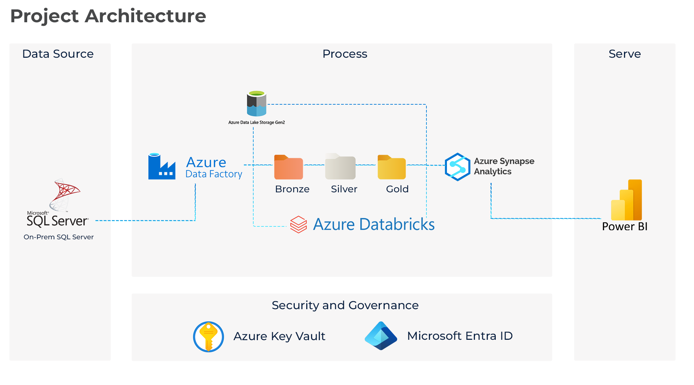
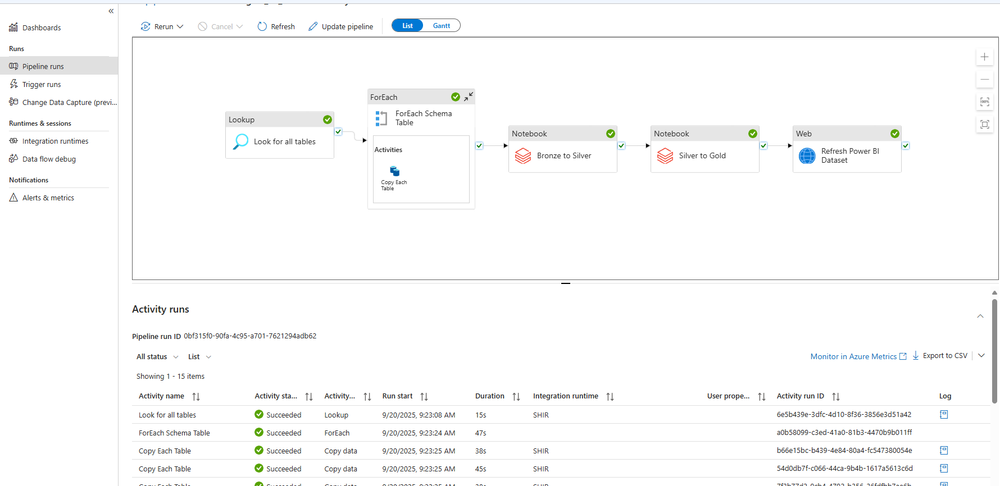
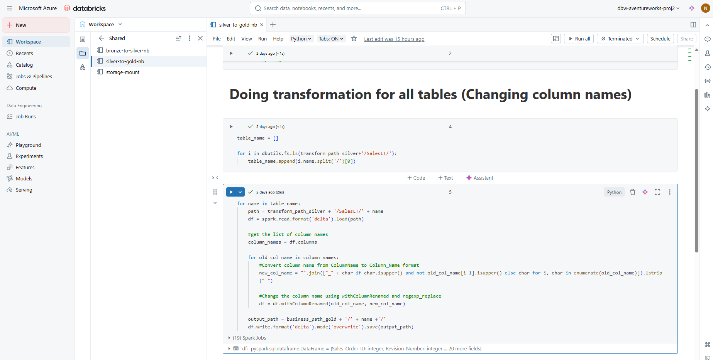
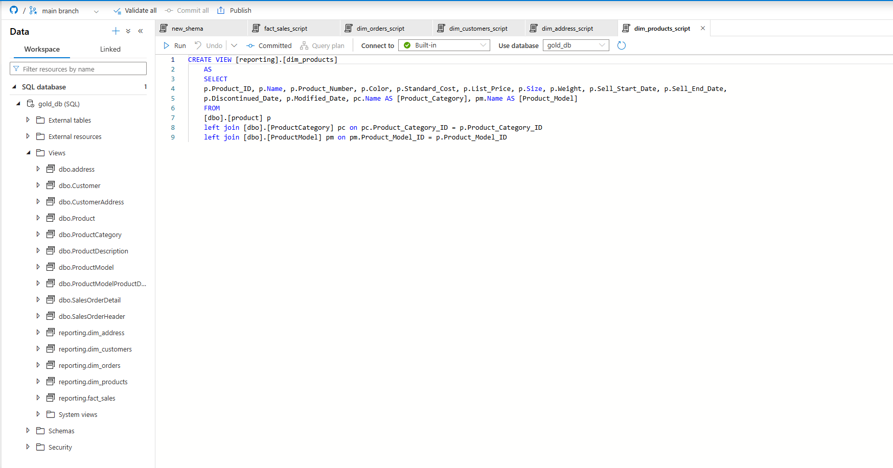
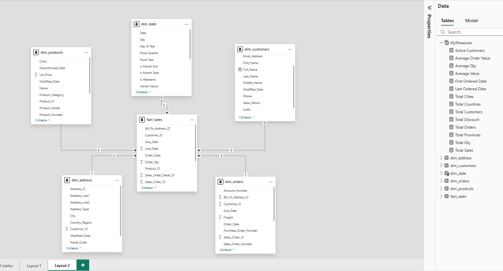
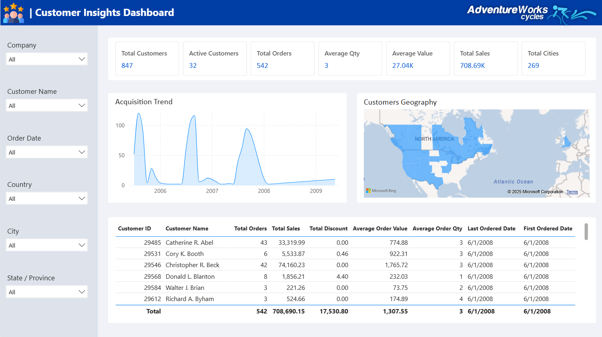
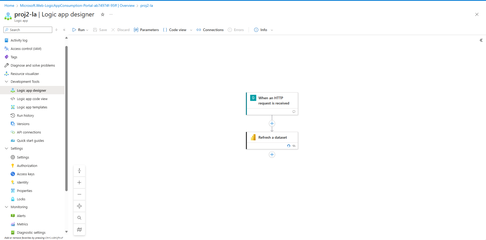

# 📚 AdventureWorks ETL BI Project Documentation

## 🔧 Architecture Overview

This project follows a medallion architecture pattern:

1. **Bronze Layer**

   - Raw data ingested from on-prem SQL Server using ADF
   - Stored in ADLS Gen2 as parquet tables

2. **Silver Layer**

   - Date Column Transformations using Databricks notebooks
   - Stored in ADLS Gen2 as Delta tables

3. **Gold Layer**

   - Maintained column name consistency and curated datasets for reporting
   - Stored in ADLS Gen2 as Delta tables
   - Views created in Synapse Analytics for semantic access

4. **Reporting Layer**

   - Power BI connected to Synapse views
   - Star Schema Data modelling
   - Customer Insights dashboard published to Power BI Service

5. **Automation Layer**
   - Azure Logic App triggers Power BI dataset refresh post-pipeline

## Pipeline

## Notebooks

## Synapse Views

## Data Modelling

## Data Visualization

## Logic App

## 🔗 GitHub Integration

- **Azure Data Factory**: Linked to GitHub for versioning pipeline JSON templates in `adf/`
- **ADB**: Notebooks exported as `.ipynb` and stored in `adb/`
- **Synapse**: Linked to GitHub for versioning pipeline JSON templates in `asa/`
- **Logic Apps**: Logic App templates downloaded and stored in `ala/`
- **SQL**: Queries stored in `sql/`
- **Power BI**: Dataset and dashboard assets stored in `pbi/`

## 📸 Screenshots available in `documentation/screenshots/`:

- ADF pipeline flow
- Databricks notebook transformations
- Synapse SQL editor
- Power BI data model and dashboard
- logic app flow
